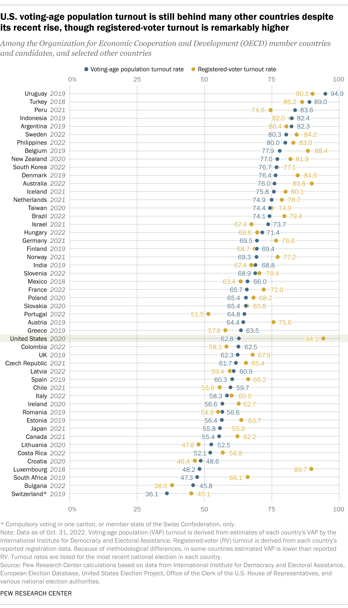

+++
date = '2026-03-21T11:21:30-05:00'
draft = false
title = 'Is the SAVE act worth it?'
+++

For a democratic society to truly function, we should be striving for the highest possible turnout of eligible voters. But in the November 2024 election, only about 73.6% of eligible US citizens were registered to vote, and only about 65.3% of eligible citizens actually voted.

How does this compare to other countries? Interestingly, our overall voter turnout as a percentage of eligible voters is below many other countries, but of those who are registered, a very high percentage actually go out and vote. See this infographic from [Pew Research Center](https://www.pewresearch.org/short-reads/2022/11/01/turnout-in-u-s-has-soared-in-recent-elections-but-by-some-measures-still-trails-that-of-many-other-countries/) from 2022 that shows this trend.

It's clear that our low voter turnout can be largely attributed to low registration rates - boosting voter registration would likely have a significant impact on the number of people voting. If we were to boost our overall voter registration rates to 90% instead of 73.6%, we would likely see overall voter turnout exceed most other countries.

## Voter turnout varies by race and income level

When you break the 2024 numbers down by race or income level, you also see some pretty big disparities. Source: [United States Census Bureau Data](https://www.census.gov/data/tables/time-series/demo/voting-and-registration/p20-587.html) (Numbers in Thousands)

| Race                | Citizen Population | Citizens Registered | Percent Registered | Citizens Voted | Percent Voted |
|---------------------|--------------------|---------------------|--------------------|----------------|---------------|
| White               | 183,117            | 137,468             | 75.1               | 123,220        | 61.9          |
| White, non Hispanic | 154,575            | 120,035             | 77.7               | 108,919        | 70.5          |
| Black               | 31,221             | 21,878              | 70.1               | 18,612         | 59.6          |
| Asian               | 12,775             | 8,337               | 65.3               | 7,288          | 57.1          |
| Hispanic (any race) | 32,765             | 20,144              | 61.5               | 16,573         | 50.6          |

White, non-hispanic voters were much more likely to be registered for and participate in voting.

There is also a significant correlation between income level and likeliness to register for and participate in voting. The discrepancy between low-income and high-income voters is pretty stark.

|     Income Level     | Registered percent | Voted percent |
|:--------------------:|:------------------:|:-------------:|
| Under $10,000        |               59.0 |          44.5 |
| $10,000 to $14,999   |               65.2 |          49.0 |
| $15,000 to $19,999   |               62.3 |          44.9 |
| $20,000 to $29,999   |               64.4 |          49.8 |
| $30,000 to $39,999   |               65.0 |          53.1 |
| $40,000 to $49,999   |               73.5 |          62.5 |
| $50,000 to $74,999   |               76.3 |          67.8 |
| $75,000 to $99,999   |               78.8 |          71.1 |
| $100,000 to $149,999 |               83.0 |          75.5 |
| $150,000 and over    |               86.4 |          80.4 |
| Income not reported  |               53.9 |          48.9 |

## Voter fraud by ineligible voters

On the other side of boosting voter registration and turnout rates, it is important that only those who are eligible actually register and participate in voting. So how often does voter fraud occur?

The Heritage Foundation maintains a [database of known election fraud cases](https://electionfraud.heritage.org/) from 1982 to now. The data is available for download. In all, there are 1620 known cases of election fraud in the database. Of those 1620, 97 were cases of non-citizens illegally voting - about 5.9%. An even smaller handful of cases were of illegal immigrants voting.

It's worth noting that these are only proven cases, and there are likely other cases of fraud that have slipped through unnoticed.

## How is fraud prevented today?

Different states have different systems for ensuring eligibility of voters.

When registering, all voters, regardless of state, must attest under penalty of perjury that they are eligible to vote - non-citizens who try to register risk jail time, fines, or deportation if caught.

There are various databases and systems that can be used to cross-reference the eligibility of those registering. USCIS maintains the [Systematic Alien Verification for Entitlements](https://www.uscis.gov/save/current-user-agencies/guidance/voter-registration-and-voter-list-maintenance-fact-sheet), or SAVE, service (not to be confused with the SAVE act), that can be used to verify immigration status of individuals registering to vote. Some states use driver's license databases and verify if the person in question provided documents that prove citizenship when getting their driver's license. The Social Security administration also has information about citizenship.

## So what about the SAVE act?

Knowing that some amount of fraud does occur, then why not pass the SAVE act?

In short, this is a question of tradeoffs. What is the proposed benefit, and what is the imposed cost?

### The benefit: more secure elections

The claimed benefit is increased confidence in the election system by adding guardrails against voting by non-citizens. However, compared to other sources of election fraud, the SAVE act is targeting a very small percentage of fraud cases - cases of non-citizens illegally registering to vote. Also, the safeguards mentioned above already provide ways to automatically check voter eligibility, reducing the benefit further.

### The tradeoff: more inconvenience to voter registration

What is the tradeoff? For this, it's important to know the [actual text](https://www.congress.gov/bill/119th-congress/house-bill/22/text).

Most people are aware by now of the added requirements for proof of citizenship. The required documents are not free, and they require some amount of extra effort to obtain if you don't have them already. And who will be impacted the most by this cost and this extra necessary time? Those with lower incomes, who are already the least likely to register to vote. We would be placing one more barrier between eligible voters and their actual opportunity to vote, even if that barrier is just inconvenience.

I also haven't seen this requirement discussed nearly as often as the documents themselves:

>“(1) PRESENTING PROOF OF UNITED STATES CITIZENSHIP TO ELECTION OFFICIAL.—An applicant who submits the mail voter registration application form prescribed by the Election Assistance Commission pursuant to section 9(a)(2) or a form described in paragraph (1) or (2) of subsection (a) shall not be registered to vote in an election for Federal office unless—
>
>“(A) the applicant presents documentary proof of United States citizenship **in person** to the office of the appropriate election official not later than the deadline provided by State law for the receipt of a completed voter registration application for the election; or
>
>“(B) in the case of a State which permits an individual to register to vote in an election for Federal office at a polling place on the day of the election and on any day when voting, including early voting, is permitted for the election, the applicant presents documentary proof of United States citizenship to the appropriate election official **at the polling place** not later than the date of the election.

For the 2024 election, over 20% of registrations were done either by mail or online (see [Table 12: Method of Registration, By Selected Characteristics: November 2024](https://www.census.gov/data/tables/time-series/demo/voting-and-registration/p20-587.html)). Adding a requirement to submit proof of citizenship in person will decrease the likelihood that these people would have or take the time to register to vote. And again, this will impact low-income citizens the most, since they are more likely to work in jobs with less flexible schedules that would allow registering to vote in person.

### Is this really the right way to handle this?

At face value, there is nothing wrong with wanting to make our election process more secure. But from a numbers perspective, this is going to cause a much larger decrease in participation by eligible voters than it will by ineligible voters. And it will disproportionately affect the poor and further widen the gap in political participation between those of low and high income levels.

There must be a better way to go about this. In the 21st century there is no excuse for the government not being able to automatically verify voter citizenship via government records. You can already order your birth certificate online just by providing your name, date and place of birth, parents' names, and some form of id. So why can't the government use that same information to verify citizenship without requiring you order that birth certificate and go in person to register to vote?

Our goal should be to make the process easier, not harder, so we can get as many people participating in the democratic process as possible. There are ways to further secure our elections without introducing more inconvenience and burden to voters, especially low-income voters.
